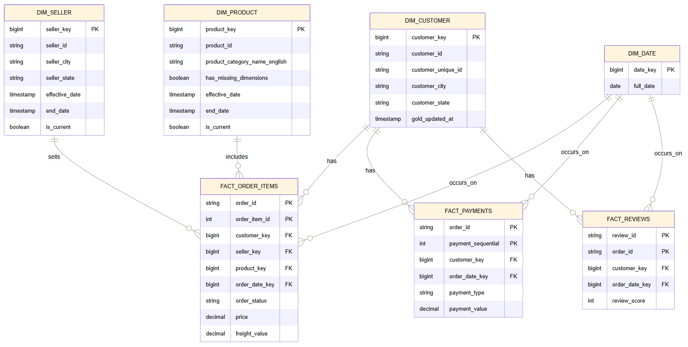

# E-Commerce Data Platform — Olist Brazilian E-Commerce
 
An end-to-end data engineering portfolio project built on the public **Olist Brazilian E-Commerce** dataset. The pipeline follows a **Medallion architecture** (Bronze → Silver → Gold) on **Databricks Free Edition**, with the Gold layer loaded into **Snowflake** and visualized in **Power BI**.
 
> 🚧 **Status: In progress.** Bronze ingestion is built and under review; Silver and Gold layers are in design/build. See [Project Status](#project-status) below for the live breakdown.
 
---
 
## Architecture
 
```
Olist CSVs  →  Unity Catalog Volume (landing zone)
             →  Bronze (Autoloader / cloudFiles, raw passthrough, Delta)
             →  Silver (cleaned, deduped, typed, standardized, Delta)
             →  Gold (star schema: SCD1/SCD2 dimensions + facts, Delta)
             →  Snowflake (Spark connector, or Delta export + COPY INTO fallback)
             →  Power BI dashboards
```
 
**Design principle:** strict Medallion layering — no business logic at Bronze, cleaning at Silver, dimensional modeling at Gold.
 
### Stack
 
| Layer | Tool |
|---|---|
| Compute & orchestration | Databricks Free Edition |
| Catalog / schema management | Unity Catalog (`ecommerce_dev.bronze`, `.silver`, `.gold`, `.audit`) |
| Storage format | Delta Lake |
| Ingestion | Databricks Autoloader (`cloudFiles`) |
| Data warehouse | Snowflake (trial) |
| BI / dashboards | Power BI |
| Project tracking | Notion |
 
> **Note on architecture evolution:** this project originally targeted Azure Data Factory + ADLS Gen2 + Azure Databricks. That plan was dropped after Azure free-tier account creation was blocked (billing/card requirement), and the project pivoted to an entirely free-tier stack: Databricks Free Edition + Unity Catalog in place of ADF/ADLS, with the same Medallion design intact.
 
---
 
## Dataset
 
[Olist Brazilian E-Commerce Public Dataset](https://www.kaggle.com/datasets/olistbr/brazilian-ecommerce) — 9 CSVs covering orders, customers, order items, payments, reviews, products, sellers, and geolocation for ~100k orders placed on the Olist marketplace between 2016–2018.
 
Raw CSVs live in [`/data`](./data) in this repo and are uploaded into a Unity Catalog Volume as the Bronze landing zone.
 
---
 
## Repository structure
 
```
.
├── data/                      # Raw Olist CSVs (9 files)
├── notebooks/
│   ├── bronze/                # Autoloader ingestion notebooks
│   ├── silver/                # Cleaning & standardization notebooks
│   └── gold/                  # Star schema build (dims, facts, SCD1/2)
├── snowflake/                 # Snowflake connection setup / COPY INTO scripts
├── powerbi/                   # .pbix dashboard file(s)
├── docs/                      # Architecture diagrams, ERD, decision notes
└── README.md
```
 
*(Structure will fill in as each phase is built — see status below.)*
 
---
 
## Data model (Gold layer)
 
Star schema with the following planned entities:
 
SCD2 changes are applied via Delta Lake `MERGE` with expire-and-insert logic (`WHEN MATCHED` → close out old row, `WHEN NOT MATCHED` → insert new current row).
 
---
 
## Pipeline observability
 
An `ecommerce_dev.audit.ingestion_log` Delta table tracks every ingestion run across all layers (append-only): `run_id`, `layer`, `table_name`, `source_path`, `status`, `rows_ingested`, timestamps, `duration_seconds`, `error_message`, and a JSON `metadata` column for schema-flexible extra fields. Failures are logged, not swallowed.
 
---
 
## Project status
 
Tracked in a [Notion kanban board](https://app.notion.com/p/595503fbb0244cb696751001759dfb09) across 7 phases. Current snapshot:
 
| Phase | Status |
|---|---|
| 1. Setup (Databricks, Unity Catalog, Snowflake trial) | ✅ Done |
| 2. Bronze — Ingestion (Unity Catalog + Autoloader) | ✅ Done |
| 3. Silver — Cleaning | ✅ Done |
| 4. Gold — Star Schema (incl. SCD1/SCD2) | ✅ Done |
| 5. Snowflake Load | ⬜ Not started |
| 6. Power BI Dashboard | ⬜ Not started |
| 7. Polish & Docs | ⬜ Not started |
 
### Known risks / open decisions
- **Databricks Free Edition serverless compute has outbound network restrictions** that can silently block connections to Snowflake — this is being validated early, before the rest of the pipeline is built on top of it.
- Snowflake **writes** require the Spark connector (`spark-snowflake`), not Lakehouse Federation (which is read-only). Serverless-compatible connection options are used: `host`, `port`, and `sfAccount` as separate parameters rather than `sfURL`.
- **Fallback plan:** if the live Spark-connector write path is blocked, Gold Delta tables will be exported to cloud storage and loaded into Snowflake via `COPY INTO`.
---
 
## KPIs (Power BI, planned)
 
Revenue, Monthly Sales, Top Products, Top Customers, Avg Delivery Time, Cancellation Rate, Payment Type Distribution, Top Cities, Customer Retention.
 
---
 
## Getting started
 
*(To be filled in once the Bronze/Silver/Gold notebooks are finalized — will include Unity Catalog setup steps, how to point Autoloader at the landing volume, and how to run the pipeline end to end.)*
 
---
 
## Author
 
Built by Riju as an end-to-end data engineering portfolio project.
